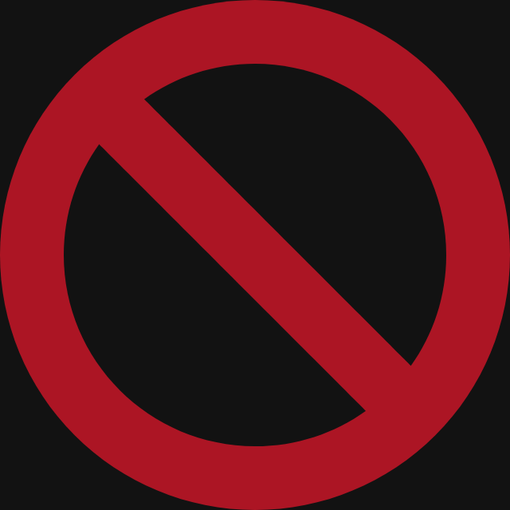

# Spicetify Playlist Labels

Adds playlist labels to your tracklist indicating the playlists in which a track is included.

## Install
Install [Spicetify](https://spicetify.app) and install "Playlist Labels" from the Marketplace.

## Star Rating Playlist Images

Thanks to [WildGenius](https://github.com/WildGenius) and [brimell](https://github.com/brimell) who made these awesome playlist images for people who wish to rate their tracks using a star rating system!

## Made with Spicetify Creator
- https://github.com/spicetify/spicetify-creator