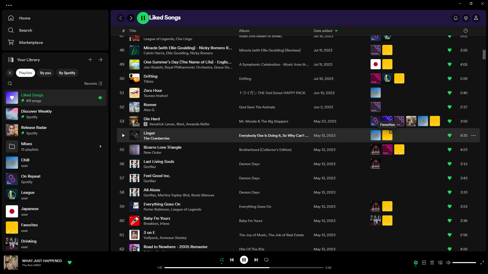

# Spicetify Playlist Labels

Adds playlist labels to your tracklist, indicating the playlist(s) in which a track is included. Clicking labels jumps to the playlist and clicking the 'X' icon removes the track from the playlist.

## Install
Install [Spicetify](https://spicetify.app) and install "Spicetify Playlist Labels" from the Marketplace.

## Made with Spicetify Creator
- https://github.com/spicetify/spicetify-creator