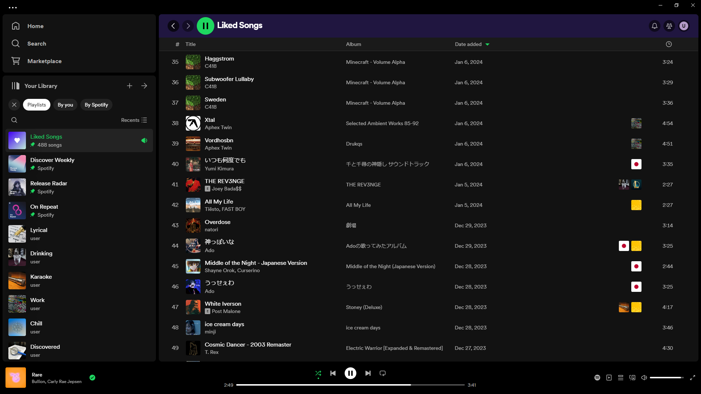

# Spicetify Playlist Labels

Adds playlist labels to your tracklist, indicating the playlists in which a track is included. Clicking a label jumps to the playlist.

Also adds a context menu item to each track allowing you to remove the track from any of the playlists it is in.

## Install
Install [Spicetify](https://spicetify.app) and install "Playlist Labels" from the Marketplace.

## Made with Spicetify Creator
- https://github.com/spicetify/spicetify-creator